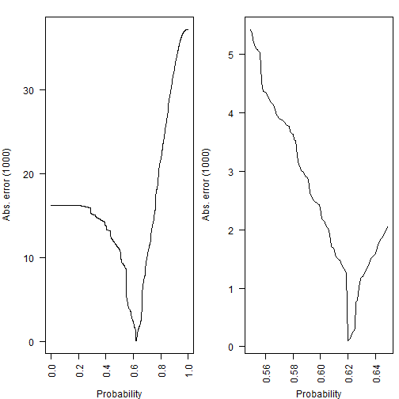
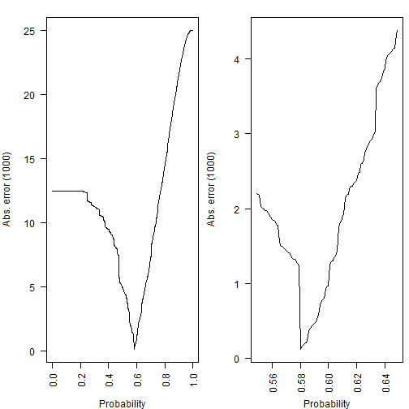
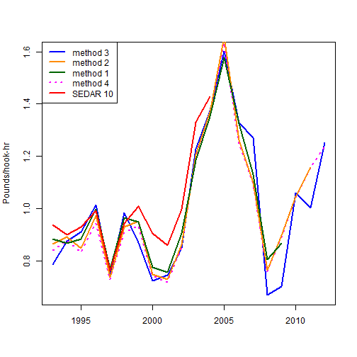

2014 Gag Commercial Handline Index of Abundance
========================================================

The 2014 update of the SEDAR 10 (2006) South Atlantic gag stock assessment requires recomputation of the commercial handline index of abundance.  The entire time series must be evaluated as recent trends will influence predictions for previous years.  This document describes changes to the methods as well as consideration of the influence of management decisions. 

**Changes from the SEDAR 10 approach**

1.  The Stephens and MacCall method for determining trips with effort in gag habitat but no catch was modified to exclude associated species with prolonged closures during part of the time series (red porgy and red snapper). The species used as factors to determine the probability of catching gag in a trip was defined as those caught in 1% of trips.  SEDAR 10 used a 5% cutoff.  


2.  The starting year for the index was changed from 1992 to 1993.  The 1992 commercial logbook data collection was voluntary.  For this reason 1992 has been excluded from all recent SEDAR assessed species.


3.  The factor for region was aggregated over the Latitude-level used in SEDAR 10 to 3 levels (North Carolina, South Carolina, and Georgia-North Florida).  This change was made to accomodate smaller samples sizes for reduced data sets discussed below.


4.  Management closures to the gag fishery occured for spawning (Jan-Apr) starting in 2010 and in October 2012 for the quota.  Three options for accounting for these changes were evaluated.  (The SEDAR 10 analysis excluded March and April due to a recreational bag limit imposed on commercial fisheries starting in 1999.) 

  *method1: 1993-2009 including all months (most similar to SEDAR 10 index)
  
  *method2:  1993-2011 excluding Jan-Apr trips (allows for longer time series and accounts for spawning closure)
  
  *method3:  1993-2012 excluding Jan-Apr trips and Oct-Dec trips  (allows for full time series and removes bias associated with spawning closure and quota closure)
  
  *method4:  1993-2012 excluding Jan-Apr trips (same as method 2 except 2012 closure in October is ignored)


**Table 1.** Commercial handline trips through 2009 for all months (method1), through 2011 without Jan-Apr (method2), and through 2012 with only May-Sep (method3).

<!-- html table generated in R 3.0.2 by xtable 1.7-1 package -->
<!-- Tue Feb 25 13:25:59 2014 -->
<TABLE border=1>
<TR> <TH> year </TH> <TH> method1 </TH> <TH> method2 </TH> <TH> method3 </TH> <TH> method4 </TH>  </TR>
  <TR> <TD align="right"> 1993 </TD> <TD align="right"> 1757 </TD> <TD align="right"> 1524 </TD> <TD align="right"> 996 </TD> <TD align="right"> 1524 </TD> </TR>
  <TR> <TD align="right"> 1994 </TD> <TD align="right"> 2176 </TD> <TD align="right"> 1698 </TD> <TD align="right"> 1059 </TD> <TD align="right"> 1698 </TD> </TR>
  <TR> <TD align="right"> 1995 </TD> <TD align="right"> 2339 </TD> <TD align="right"> 1876 </TD> <TD align="right"> 1236 </TD> <TD align="right"> 1876 </TD> </TR>
  <TR> <TD align="right"> 1996 </TD> <TD align="right"> 2314 </TD> <TD align="right"> 1914 </TD> <TD align="right"> 1229 </TD> <TD align="right"> 1914 </TD> </TR>
  <TR> <TD align="right"> 1997 </TD> <TD align="right"> 2156 </TD> <TD align="right"> 1820 </TD> <TD align="right"> 1144 </TD> <TD align="right"> 1820 </TD> </TR>
  <TR> <TD align="right"> 1998 </TD> <TD align="right"> 2282 </TD> <TD align="right"> 1877 </TD> <TD align="right"> 1178 </TD> <TD align="right"> 1877 </TD> </TR>
  <TR> <TD align="right"> 1999 </TD> <TD align="right"> 1705 </TD> <TD align="right"> 1475 </TD> <TD align="right"> 852 </TD> <TD align="right"> 1475 </TD> </TR>
  <TR> <TD align="right"> 2000 </TD> <TD align="right"> 1503 </TD> <TD align="right"> 1365 </TD> <TD align="right"> 847 </TD> <TD align="right"> 1365 </TD> </TR>
  <TR> <TD align="right"> 2001 </TD> <TD align="right"> 1746 </TD> <TD align="right"> 1554 </TD> <TD align="right"> 995 </TD> <TD align="right"> 1554 </TD> </TR>
  <TR> <TD align="right"> 2002 </TD> <TD align="right"> 1897 </TD> <TD align="right"> 1679 </TD> <TD align="right"> 1036 </TD> <TD align="right"> 1679 </TD> </TR>
  <TR> <TD align="right"> 2003 </TD> <TD align="right"> 1672 </TD> <TD align="right"> 1523 </TD> <TD align="right"> 952 </TD> <TD align="right"> 1523 </TD> </TR>
  <TR> <TD align="right"> 2004 </TD> <TD align="right"> 1570 </TD> <TD align="right"> 1428 </TD> <TD align="right"> 834 </TD> <TD align="right"> 1428 </TD> </TR>
  <TR> <TD align="right"> 2005 </TD> <TD align="right"> 1512 </TD> <TD align="right"> 1380 </TD> <TD align="right"> 934 </TD> <TD align="right"> 1380 </TD> </TR>
  <TR> <TD align="right"> 2006 </TD> <TD align="right"> 1486 </TD> <TD align="right"> 1333 </TD> <TD align="right"> 845 </TD> <TD align="right"> 1333 </TD> </TR>
  <TR> <TD align="right"> 2007 </TD> <TD align="right"> 1680 </TD> <TD align="right"> 1528 </TD> <TD align="right"> 971 </TD> <TD align="right"> 1528 </TD> </TR>
  <TR> <TD align="right"> 2008 </TD> <TD align="right"> 1563 </TD> <TD align="right"> 1410 </TD> <TD align="right"> 908 </TD> <TD align="right"> 1410 </TD> </TR>
  <TR> <TD align="right"> 2009 </TD> <TD align="right"> 1623 </TD> <TD align="right"> 1484 </TD> <TD align="right"> 1006 </TD> <TD align="right"> 1484 </TD> </TR>
  <TR> <TD align="right"> 2010 </TD> <TD align="right"> NA </TD> <TD align="right"> 1456 </TD> <TD align="right"> 1001 </TD> <TD align="right"> 1456 </TD> </TR>
  <TR> <TD align="right"> 2011 </TD> <TD align="right"> NA </TD> <TD align="right"> 1473 </TD> <TD align="right"> 986 </TD> <TD align="right"> 1473 </TD> </TR>
  <TR> <TD align="right"> 2012 </TD> <TD align="right"> NA </TD> <TD align="right"> NA </TD> <TD align="right"> 1088 </TD> <TD align="right"> 1201 </TD> </TR>
   </TABLE>


Figure 1.  Method 1:  Estimates of species-specific regression coefficients used to estimate a trip's probability of catching gag.


 

Figure 2.  Method 1:  Absolute difference between observed and predicted number of positive gag trips.  Left and right panels differ only in the range of probabilities shown.

 


```
## elapsed 
##   123.2
```

```
## elapsed 
##   15.22
```

Figure 3.  Method 2: Estimates of species-specific regression coefficients used to estimate a trip's probability of catching gag.


 

Figure 4.  Method 2: Absolute difference between observed and predicted number of positive gag trips.  Left and right panels differ only in the range of probabilities shown.

 


```
## elapsed 
##   87.69
```

```
## elapsed 
##    8.94
```

Figure 5.  Method 3: Estimates of species-specific regression coefficients used to estimate a trip's probability of catching gag.


 

Figure 6.  Method 3: Absolute difference between observed and predicted number of positive gag trips.  Left and right panels differ only in the range of probabilities shown.

 


```
## elapsed 
##     127
```

```
## elapsed 
##   13.45
```

Figure 7.  Method 4: Estimates of species-specific regression coefficients used to estimate a trip's probability of catching gag.


 

Figure 8.  Method 4: Absolute difference between observed and predicted number of positive gag trips.  Left and right panels differ only in the range of probabilities shown.

 


Figure 9.  Estimated index for the four methods using a lognormal error distribution.
 

Method 2 allows the commercial handline index to extend to 2011 and matches the trend in the index when January and February are included.  Method 3 deviates from the trend in the index when October through December are included, especially at the end of the series.  The influence of the 2012 closure in method 4 was cause for concern.  For these reasons, method 2, May to September index through 2011 was chosen for input to the update of the SEDAR 10 gag stock assessment.  The data were fit better using a lognormal distribution as compared to a gamma distribution for all methods.  The uncertainty in the estimates were calculated from 1000 bootstrap runs of the model.

Figure 10. Diagnostics of lognormal model fits to positive CPUE data.  The histogram of empirical log CPUE, with the normal distribution (empirical mean and variance) overlaid.

 

Figure 11.  Quantile-quantile plot of residuals from the fitted model.
 


```
## [1] "Starting bootstrap # 1 out of 5"
## [1] "Starting bootstrap # 2 out of 5"
## [1] "Starting bootstrap # 3 out of 5"
## [1] "Starting bootstrap # 4 out of 5"
## [1] "Starting bootstrap # 5 out of 5"
```

Figure 12.  Raw residuals of lognormal model fits to positive CPUE for year.  Box-and-whisker plots give first, second (median), and third quartiles, as well as limbs that extend approximately one interquartile range beyond the nearest quartile, and outliers (circles) beyond the limbs.  Sample size is given along the upper whisker.


